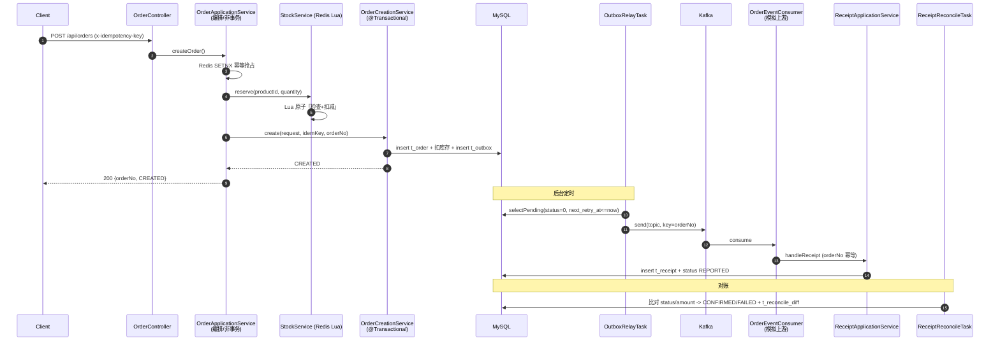
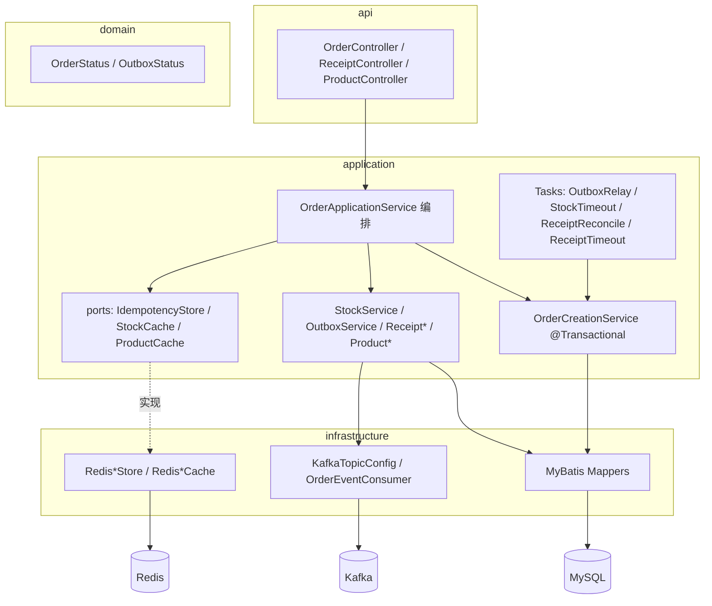

# trading-order-service

> 个人作品集项目（**非生产系统**，如实标注）。目标：能跑、能压测、能演示、能讲清，
> 把「我说做过」变成「你看代码」。当前进度：**D1–D13 完成**。

```
api ──▶ application ──▶ domain ──▶ infrastructure ──▶ MySQL / Redis / Kafka
        (编排/幂等/库存/事务)        (领域枚举)        (MyBatis / Redis / Kafka)
```

## 1. 定位

复刻简历主题（交易/订单、幂等、库存防超卖、Outbox 最终一致性、缓存治理）的 Java 后端项目，
覆盖高并发下单的核心考点，作为面试可演示、可追问的作品。

- 设计参考：《项目设计文档.md》（原稿偏 Go/gRPC，本项目用 **Java + REST** 适配）
- 进度计划：《MVP两周冲刺计划.md》

## 2. 技术栈

| 层 | 选型 |
| --- | --- |
| 语言 / 框架 | Java 17、Spring Boot 3.2.5 |
| Web | Spring MVC（REST）、Jakarta Validation |
| 持久化 | MyBatis 3（mybatis-spring-boot-starter 3.0.3）、MySQL 8 |
| 缓存 / 库存 | Redis 7（spring-data-redis） |
| 消息 | Kafka 3.7（KRaft 单节点，spring-kafka） |
| 测试 | JUnit 5、AssertJ、H2（内存库） |
| 部署 | Docker Compose |

## 3. 架构（DDD 分层）

包结构：`com.fuzuyang.trading.{api, application, domain, infrastructure, common}`

### 全局链路



### 分层组件



## 4. 设计取舍

| 主题 | 取舍 | 理由 |
| --- | --- | --- |
| 幂等正确性 | Redis `SETNX` 仅作性能优化，`uk_idempotent_key` 唯一索引才是正确性保证 | Redis 可降级；DB 约束不丢 |
| 库存扣减 | Redis Lua 闸门 + DB **条件原子更新**（`WHERE available >= ?`） | 高并发下不产生大量版本冲突误失败（优于 version 乐观锁） |
| 订单号 | `yyyyMMddHHmmssSSS` + `AtomicLong` 序列（单机） | 兼顾可读性与唯一性；多实例可换 Snowflake |
| 唯一约束冲突 | 捕获 `DuplicateKeyException` 后**主动查库**区分 `uk_order_no` / `uk_idempotent_key` | 不解析驱动异常消息；订单号碰撞可换号重试 |
| 消息一致性 | 下单事务内同写 `t_order`+`t_outbox`，定时投递，替代 2PC | 无分布式事务依赖，最终一致 |
| 投递语义 | 至少一次 + 消费端按 `orderNo` 幂等 | 收敛为「恰好一次」效果 |
| 事务边界 | 编排层非事务 + 落单层独立 `@Transactional` | 规避重试时 `rollback-only` / `UnexpectedRollbackException` |
| 缓存一致性 | cache-aside：先更库再删缓存 + 空值缓存 + TTL 随机 | 兼顾一致性、穿透/雪崩防护 |
| 上游模拟 | 消费者直调应用服务，另暴露 `POST /api/receipts` | 简化回环，接口仍可供外部上游调用 |

## 5. 我实现了什么

- **高并发下单与防超卖**：Redis Lua 原子预扣 + DB 条件扣减兜底，单机 100 并发压测 **0 超卖**、5000 请求 **0 错误**（见 [D12 压测复盘](docs/D12压测复盘.md)）。
- **幂等与一致性**：`x-idempotency-key` 幂等（Redis SETNX + DB 唯一索引兜底）；通过主动查库区分唯一约束，修复高并发下 0.04% 的订单号碰撞误判。
- **可靠消息最终一致性**：以 Outbox 替代 2PC，定时轮询投递 Kafka + 消费幂等 + 回执对账，实现订单与回执最终一致。
- **缓存治理**：Cache-Aside + 随机 TTL 防雪崩 + 空值缓存防穿透 + 先更库再删缓存。
- **架构分层与事务边界**：编排层（非事务）与落单层（独立事务）分离，从架构上规避 `@Transactional` 重试导致的 `UnexpectedRollbackException`。

## 6. 数据库设计

| 表 | 关键字段 | 关键索引 |
| --- | --- | --- |
| `t_order` | order_no、status、idempotent_key、amount | `uk_order_no`、`uk_idempotent_key`、`idx_user_created(user_id, created_at)` |
| `t_stock` | available、version | 主键 `product_id` |
| `t_outbox` | status、retry_count、next_retry_at | `idx_status_next(status, next_retry_at)` |
| `t_receipt` | order_no、upstream_no、status、amount | `uk_receipt_order_no(order_no)` |
| `t_reconcile_diff` | order_no、diff_type、detail | `idx_reconcile_order_no(order_no)` |
| `t_product` | product_id、name、price | 主键 `product_id` |

建表与种子数据见 [`sql/init.sql`](sql/init.sql)。

## 7. 快速导航

| 内容 | 位置 |
| --- | --- |
| 10 分钟演示讲稿 | [`docs/DEMO.md`](docs/DEMO.md) |
| 一键演示脚本 | [`scripts/demo.ps1`](scripts/demo.ps1) |
| 端到端回归 | [`scripts/e2e-test.ps1`](scripts/e2e-test.ps1) |
| 故障注入（Redis/Kafka/MySQL 宕机、进程崩溃） | [`scripts/chaos-test.ps1`](scripts/chaos-test.ps1) |
| 压测计划 | [`loadtest/order_load.jmx`](loadtest/order_load.jmx)（数据见 §11） |
| 踩坑与问题记录 | [`docs/踩坑与问题记录.md`](docs/踩坑与问题记录.md) |
| D12 压测复盘 | [`docs/D12压测复盘.md`](docs/D12压测复盘.md) |
| 测试报告模板 | [`docs/测试报告模板.md`](docs/测试报告模板.md) |

### 踩坑精选（详情见 docs/）

- **H2 中文种子乱码**：Windows 上 Spring `spring.sql.init` 默认按平台编码(GBK)读 `schema.sql`，显式 `spring.sql.init.encoding: UTF-8` 解决。
- **订单号碰撞误判**：秒级时间戳+随机在 ~170 单/秒发生生日碰撞，且 `DuplicateKeyException` 被误当幂等冲突 → 改毫秒时间戳+序列，并主动查库区分唯一约束（见 [D12 压测复盘](docs/D12压测复盘.md)）。
- **预热与回补竞态**：启动预热与超时回补并发写 Redis，旧值可能覆盖回补 → 定时任务首次执行延迟一个周期。
- **失败路径回补不一致**：对账失败(FAILED)与超时失败的回补行为需一致，否则破坏库存守恒不变量（见 [踩坑与问题记录](docs/踩坑与问题记录.md)）。
- **200 并发首连偶发异常**：客户端连接池 + `localhost` 双栈竞态 → 改用 `127.0.0.1` 并对幂等接口安全重试。

## 8. 启动步骤

前置：JDK 17、Maven 3.9+、Docker Desktop。

```powershell
# 1) 启动依赖（MySQL 映射到宿主机 3307，因本机 3306 已被占用）
docker compose up -d
docker compose ps

# 2) 编译与测试
mvn -Dfile.encoding=UTF-8 clean test
mvn -Dfile.encoding=UTF-8 -DskipTests package

# 3) 启动应用
mvn -Dfile.encoding=UTF-8 spring-boot:run
# 或：java -Dfile.encoding=UTF-8 -jar target/trading-order-service-0.0.1-SNAPSHOT.jar

# 4) 健康检查
curl http://localhost:8080/api/health
```

预期返回：

```json
{"code":0,"message":"ok","data":{"app":"trading-order-service","status":"UP","profiles":["local"],"timestamp":"..."}}
```

> 说明：MySQL / Redis / Kafka 未启动时应用**仍可正常启动**，`/api/health` 仍返回 200
> （数据源设置了 `initialization-fail-timeout: -1`，Redis/Kafka 为懒连接）。

### 下单接口（D3–D5）

```bash
curl -X POST http://localhost:8080/api/orders \
  -H "Content-Type: application/json" \
  -H "x-idempotency-key: idem-001" \
  -d '{"userId":"U1","productId":"P1001","quantity":2}'
```

```json
{"code":0,"message":"ok","data":{"orderNo":"20260921190500xxxxxx","status":"CREATED"}}
```

参数非法（如缺 `userId`）或缺请求头 `x-idempotency-key` 返回 HTTP 400：

```json
{"code":400,"message":"userId: userId 不能为空","data":null}
```

库存不足返回 HTTP 422：

```json
{"code":422,"message":"库存不足: productId=P1001","data":null}
```

#### 幂等（D4）

- 幂等键由请求头 `x-idempotency-key` 传入。
- 流程：Redis `SET key value NX EX 86400`（24h）抢占 → 命中则返回首单 → `t_order.uk_idempotent_key` 唯一索引兜底。
- 结论：**Redis 只是性能优化，DB 唯一约束才是正确性保证**；Redis 不可用时自动降级，仅靠唯一索引仍只落 1 单。
- 相同 key 重复调用返回**同一个 orderNo**；同 key 首单仍在处理中时返回 HTTP 409。

#### 库存（D5）

- 启动预热 `t_stock` 到 Redis（`stock:{productId}`）。
- 下单：Redis **Lua 原子「检查+扣减」**（并发闸门）→ DB `UPDATE ... WHERE available >= ?`（持久真相）→ 状态机 `INIT → STOCK_LOCKED → CREATED`。
- 失败补偿：落单失败回补 Redis 预扣；`DuplicateKeyException` 回补多余预扣。
- Redis 不可用 → 降级为纯 DB 条件扣减，仍不超卖。
- 超时回补：`@Scheduled` 扫描长时间停留 `STOCK_LOCKED` 的订单（`app.stock.lock-timeout`，默认 15 分钟）→ 回补 DB+Redis 库存并置 `FAILED`。
- 踩坑：预热与超时任务会并发写 Redis，故定时任务首次执行延迟一个周期（`initialDelayString`），确保预热先完成，避免旧值覆盖回补结果。

#### Outbox 可靠投递（D6）

- 下单事务内**同写 `t_order` + `t_outbox`**（本地事务保证「订单落库 ⇔ 消息待投递」）。
- 后台任务 `OutboxRelayTask` 按 `idx_status_next(status, next_retry_at)` 扫描待发送消息，投递 Kafka（topic `trading.order.events`，key=orderNo 保证同单有序）。
- 失败按**指数退避**重试：`delay = min(5s × 2^(retry-1), 5min)`；达到 `max-retries`(默认 5) 置 `FAILED` 并打 ERROR 日志。
- 语义「至少一次」，消费端幂等（D8）达到「恰好一次」效果；Kafka 不可用不影响下单。
- 配置见 `application.yml` 的 `app.outbox.*`；测试环境用 `app.outbox.relay-enabled=false` 关闭定时投递。

#### Outbox 异常路径与投递语义（D7 缓冲日）

- **状态机**：`PENDING(0)` —— 投递成功 → `SENT(1)`；失败未达上限 → `reschedule` 保持 `PENDING`（更新 `retry_count`/`next_retry_at`）；达上限 → `FAILED(2)`，之后不再被 `selectPending` 选中。
- **重复投递（at-least-once）来源**：
  1. Kafka 不可用时 producer 会缓冲记录，恢复后投出；而 relay 因 `get()` 超时判定失败并重试 → 同一消息可能多次投出（D6 实测重复 4 次）。
  2. 发送成功但 `markSent` 前进程崩溃 → 恢复后再次投递。
  - 结论：投递是「至少一次」，需**消费端按业务唯一 id（orderNo）幂等**收敛为「恰好一次」（D8）。
- **多实例扫描局限**：单实例用 `selectPending`；多实例可 `SELECT ... FOR UPDATE SKIP LOCKED` 或按 id 分片。
- **面试口径**：本地事务写 `t_order`+`t_outbox` 解决「DB 与消息一致性」；退避与上限防雪崩；至少一次 + 消费幂等 = 恰好一次。

#### Kafka 消费者与回执（D8）

- `OrderEventConsumer` 监听 `trading.order.events`（group `trading-order-service`），模拟上游消费。
- 消费幂等：以业务唯一键 `orderNo` 为准，先查 `t_receipt`，命中直接返回；`uk_receipt_order_no` 唯一索引兜底并发/重复。
- 处理成功后订单状态 `CREATED → REPORTED`，并落 `t_receipt`（含上游流水号）。
- 另提供 `POST /api/receipts` 回执接口（`{orderNo, upstreamNo, status}`），消费者内部直调同一应用服务。
- 处理失败抛异常，交给 Spring Kafka 默认错误处理器重试（配合幂等最终一致）。

#### 回执对账与最终一致（D9）

- `ReceiptReconcileTask` 扫描 `REPORTED` 且有回执的订单，比对 `receipt.status`（1 成功）与 `receipt.amount` vs 订单 `amount`：
  - 一致 → 订单 `CONFIRMED`；
  - 金额不一致 → `FAILED` + 写差异 `AMOUNT_MISMATCH`；
  - 上游失败 → `FAILED` + 写差异 `UPSTREAM_FAILED`。
- `ReceiptTimeoutTask` 扫描 `CREATED` 超过 `app.receipt.timeout`（默认 15 分钟）且无回执的订单 → `FAILED` + 回补库存(DB+Redis) + 写差异 `RECEIPT_TIMEOUT`。
- 迟到回执：订单已被置 `FAILED` 时，`handleReceipt` 只记 `LATE_RECEIPT` 差异，不回退状态。
- 差异记录在 `t_reconcile_diff`；本地 DB 为唯一事实来源，最终状态 `CREATED → REPORTED → CONFIRMED / FAILED`。

#### 缓存治理（D10）

- `GET /api/products/{productId}`：**cache-aside**，先查 Redis(`product:{id}`)，miss 回源 `t_product` 并写缓存。
- **防穿透**：商品不存在时写空值标记 `__NULL__`（TTL `app.product.null-cache-ttl`，默认 30s），后续直接返回 404 不再查库。
- **防雪崩**：写缓存 TTL 随机化 `base ± jitter`（默认 5min ± 1min）。
- **一致性**：`PUT /api/products/{id}` 先更库、再删缓存（cache-aside 标准顺序；README 说明延迟双删与反序竞态）。
- Redis 不可用时降级直读 DB，不影响接口。

```bash
curl http://localhost:8080/api/products/P1001
# {"code":0,"message":"ok","data":{"productId":"P1001","name":"商品A","price":100.00}}

curl -X PUT http://localhost:8080/api/products/P1001 \
  -H "Content-Type: application/json" -d '{"name":"商品A改","price":88.00}'
```

### 端口约定

| 服务 | 宿主机端口 | 说明 |
| --- | --- | --- |
| 应用 | 8080 | |
| MySQL | **3307** | 本机 3306 被服务 `MySQL267` 占用，故容器映射 3307 |
| Redis | 6379 | |
| Kafka | 9092 | |

## 9. 目录结构

```
trading-order-service/
  pom.xml
  docker-compose.yml
  sql/init.sql
  src/main/java/com/fuzuyang/trading/
    TradingOrderServiceApplication.java
    api/controller/{HealthController,OrderController,ReceiptController,ProductController}.java
    api/dto/{CreateOrderRequest,CreateOrderResponse,HandleReceiptRequest,ProductResponse,UpdateProductRequest}.java
    application/service/OrderApplicationService.java   # 幂等 + 库存编排
    application/service/OrderCreationService.java      # @Transactional 落单 + DB 扣减
    application/service/ReceiptApplicationService.java # 回执幂等处理
    application/service/ReceiptReconcileService.java   # 回执对账（比对 status/amount）
    application/service/ProductApplicationService.java # 商品缓存治理（cache-aside/空值/TTL 随机）
    application/service/StockService.java              # 库存预热/预扣/回补
    application/service/StockWarmUpRunner.java         # 启动预热
    application/service/OutboxService.java             # Outbox 写入（同事务）
    application/event/OrderCreatedEvent.java           # 事件消息体
    application/task/{StockTimeoutTask,OutboxRelayTask,ReceiptReconcileTask,ReceiptTimeoutTask}.java
    application/port/{IdempotencyStore,StockCache,ProductCache}.java # 端口
    infrastructure/redis/{RedisIdempotencyStore,RedisStockCache,RedisProductCache}.java  # Redis 实现
    infrastructure/kafka/{KafkaTopicConfig,OrderEventConsumer}.java    # Topic + 消费者
    domain/enums/                # OrderStatus / OutboxStatus
    infrastructure/persistence/entity/   # 4 个 DO
    infrastructure/persistence/mapper/   # 4 个 Mapper 接口
    common/ApiResponse.java  common/ErrorCode.java  common/exception/{GlobalExceptionHandler,BusinessException}.java
  src/main/resources/
    application.yml  application-local.yml  mapper/*.xml  lua/stock_deduct.lua
  src/test/...                   # 单测 + 集成测试（H2）；perf/OrderConcurrencyLocalIT 本地并发
  docs/                          # DEMO.md / 踩坑与问题记录.md / D12压测复盘.md / 测试报告模板.md
  scripts/                       # demo.ps1 / e2e-test.ps1 / chaos-test.ps1 / reset-data.sql / consistency-check.sql
  loadtest/order_load.jmx        # JMeter 压测计划
```

## 10. 进度清单

### D1–D13 已完成
- [x] Maven 工程骨架（Spring Boot 3.2.5 + Java 17，UTF-8）
- [x] 五层目录结构（api/application/domain/infrastructure/common）
- [x] `application.yml` / `application-local.yml`（MySQL 3307、Redis 6379、Kafka 9092）
- [x] `docker-compose.yml`：MySQL 8 / Redis 7 / Kafka 3.7（KRaft），含 healthcheck 与数据卷
- [x] `sql/init.sql`：4 张表 + 索引 + 2 条库存种子
- [x] 4 个 DO + 4 个 MyBatis Mapper（基础方法）
- [x] REST 健康检查 `GET /api/health`
- [x] `.gitignore`、README
- [x] **D3** 下单主链路 `POST /api/orders`：Jakarta 校验 → 落单 → 状态机
- [x] 统一错误结构 `GlobalExceptionHandler`（校验失败 HTTP 400 + `ApiResponse`）
- [x] **D4** 幂等：请求头 `x-idempotency-key` + Redis SETNX(24h) + `uk_idempotent_key` 兜底
- [x] Redis 宕机自动降级，仅靠 DB 唯一索引仍只落 1 单
- [x] **D5** 库存：Redis Lua 原子预扣 + DB 条件扣减兜底 + 超时回补
- [x] 状态机接入 `INIT → STOCK_LOCKED → CREATED`；库存不足返回 422
- [x] **D6** Outbox：下单同事务写 `t_outbox` + 定时投递 Kafka + 指数退避重试
- [x] **D7** 缓冲日：补 Outbox 异常路径测试（扫描过滤/终态不重试/批内隔离）+ 文档
- [x] **D8** Kafka 消费者（模拟上游）+ 回执接口：消费幂等（orderNo）+ 状态 `CREATED → REPORTED`
- [x] **D9** 回执对账：比对 status/amount → `CONFIRMED`/`FAILED` + `t_reconcile_diff`；超时无回执回补库存
- [x] **D10** 缓存治理：商品 cache-aside + 空值缓存防穿透 + TTL 随机化防雪崩 + 先更库再删缓存
- [x] **D11** 异常路径测试：库存不足/重复请求/投递失败/重复回执/非法 JSON/全局异常码映射
- [x] **D12** 压测（JMeter）：并发下单 + 不超卖验证；发现并修复订单号碰撞 bug；Hikari 连接池调优复测
- [x] **D13** 文档完善：README 架构图（Mermaid）/设计取舍/我实现了什么/快速导航；演示讲稿与一键演示脚本
- [x] 测试：单测 + H2 全链路集成测试（含 outbox 落库、回执幂等、对账、超时、缓存、异常路径、Mapper 边界）

### D14 待做
- [ ] D14 上传 GitHub 收尾 + 更新简历（项目经历/链接）

## 11. 压测数据（D12）

> 工具：Apache JMeter 5.6.3（非 GUI）；压测计划见 [`loadtest/order_load.jmx`](loadtest/order_load.jmx)。
> 环境：**单机压测，JMeter 与被测应用共享同一台机器 CPU**，MySQL/Redis/Kafka 亦同机容器；数据为本地演示参考，非生产基准。
> 命令：`jmeter -n -t loadtest/order_load.jmx -Jthreads=100 -Jloops=50 -Jproduct=P1001 -l r.jtl -e -o report/`
> 幂等键 `__UUID()`、userId `U-load-${__Random(1,10000)}`（模拟多用户）；无思考时间（极限施压）。

### 场景一：吞吐/延迟（P1001 库存充足，100 线程 × 50 = 5000 请求）

| 指标 | 基线 | 修复订单号 bug + Hikari 10→30 |
| --- | --- | --- |
| 成功 | 4998 × 200 | **5000 × 200** |
| 错误 | 2 × 409（订单号碰撞误判） | **0** |
| QPS | 150.6 /s | 155.8 /s |
| P50 | 649 ms | 626 ms |
| P90 | 724 ms | 675 ms |
| P95 | 741 ms | 692 ms |
| P99 | 907 ms | 809 ms |
| Avg / Max | 642 / 7424 ms | 626 / 1017 ms |

### 场景二：不超卖（P1002 库存 100，100 线程 × 3 = 300 请求）

| 指标 | 结果 |
| --- | --- |
| 响应 | 100 × 200（成功）+ 200 × 422（库存不足），0 × 5xx |
| QPS | 345.6 /s |
| P50 / P90 / P95 / P99 | 61 / 242 / 300 / 357 ms |
| 库存校验 | DB `available=0`、无负库存、成功订单=100、Redis `stock:P1002=0` |

### 压测发现并修复的 Bug

- **现象**：场景一 5000 请求出现 2 个 409（0.04%）。
- **根因**：`OrderNoGenerator` 原为 `yyyyMMddHHmmss`(秒) + 6 位随机，同一秒 ~170 单时生日碰撞；且 `OrderApplicationService` 把 `DuplicateKeyException` 一律当幂等键冲突，实为 `uk_order_no` 碰撞 → 误返回 409。
- **修复**：订单号改 `yyyyMMddHHmmssSSS`(毫秒) + `AtomicLong` 3 位序列；捕获 `DuplicateKeyException` 后**主动查幂等键**区分——命中即幂等冲突返回首单，未命中即订单号碰撞则换号重试（≤3 次）。
- **效果**：5000 请求 0 错误。

> 结论：`QPS ≈ 并发 / 平均延迟`（Little's Law）。Hikari 10→30 主要改善尾延迟（P99 907→809ms）；QPS 未显著提升说明瓶颈更可能在单机 CPU 与端到端 SQL 往返，可作后续调优方向（减少状态 UPDATE、合批/异步化）。

## 12. 明确不做

分库分表、Elasticsearch、微服务拆分、Spring Cloud 全家桶（面试口述，不写代码）。
